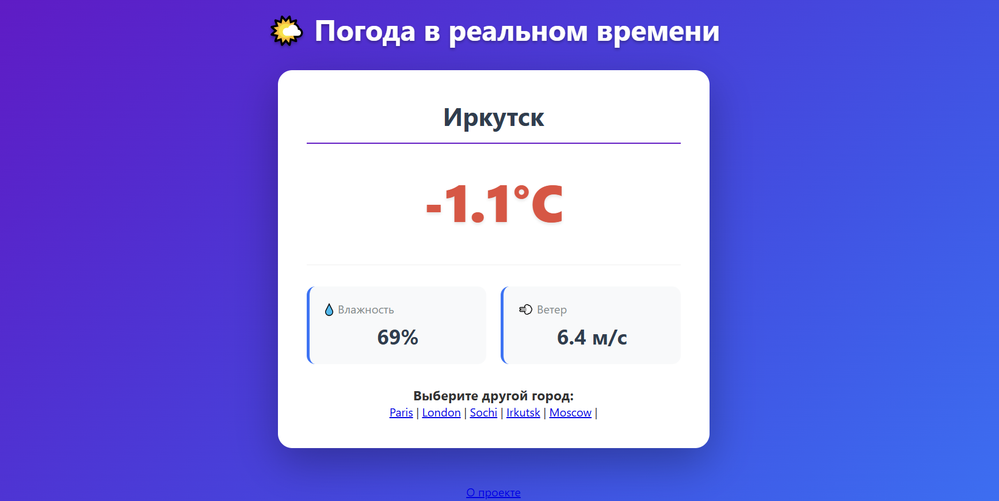

# 🌤️ Weather App – Django + Open-Meteo API

Простое веб-приложение для просмотра текущей погоды в разных городах мира. Проект создан для изучения работы с внешними API, кэширования запросов и основ Django.

## 🚀 Функциональность

- Просмотр текущей погоды (температура, влажность, ветер, описание) для выбранного города.
- Поддержка нескольких городов: Москва, Иркутск, Сочи, Лондон, Париж.
- Автоматическое обновление данных каждые 5 минут (кэширование запросов к API).
- Красивый адаптивный интерфейс с CSS-анимациями.
- Обработка ошибок (проблемы с сетью, таймауты API).

## 🛠️ Технологии

- **Backend:** Django 5.0, Python 3.12
- **API:** [Open-Meteo](https://open-meteo.com/) (бесплатный, без API-ключа)
- **Кэширование:** `requests-cache` (кэширование ответов API на 5 минут)
- **HTTP-клиент:** `requests`
- **Фронтенд:** HTML5, CSS3 (адаптивный дизайн)
- **Версионирование:** Git

## 📁 Структура проекта
```
weather_project/
├── weather/ # Основное приложение
│ ├── templates/weather/ # HTML-шаблоны
│ │ ├── weather.html # Главная страница с погодой
│ │ └── error.html # Страница ошибки
│ ├── static/weather/css/ # Стили
│ │ └── style.css
│ ├── views.py # Логика получения и обработки погоды
│ ├── urls.py # Маршруты приложения
│ └── ...
├── weather_project/ # Настройки проекта
├── .gitignore
├── requirements.txt
└── README.md
```

## 🔧 Установка и запуск

1. **Клонируй репозиторий**
   ```bash
   git clone https://github.com/bukh-sun/weather-project.git
   cd weather-project
   
2. **Создай виртуальное окружение и активируй его**   
python -m venv venv
# Windows:
venv\Scripts\activate
# Mac/Linux:
source venv/bin/activate

3. **Установи зависимости**
pip install -r requirements.txt

4. Примени миграции
python manage.py migrate

5. Запусти сервер разработки
python manage.py runserver

6. Открой в браузере http://127.0.0.1:8000/ и выбери город.

## 🌍 Использование API
Проект использует Open-Meteo API. Пример запроса:

https://api.open-meteo.com/v1/forecast?latitude=55.7558&longitude=37.6173&current=temperature_2m,relative_humidity_2m,wind_speed_10m,weather_code&timezone=auto

## 📸 Скриншоты

 – главная страница с погодой в Иркутске.

👩‍💻 Автор
Таня Бухаева
GitHub: Bukh-sun